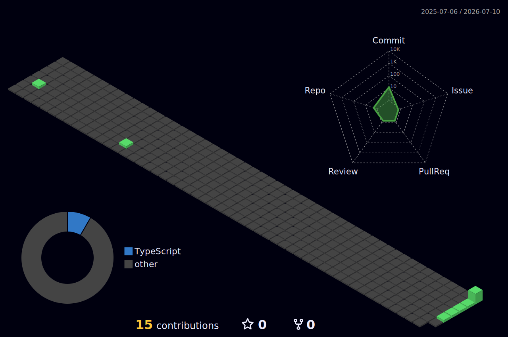

 

  

---

## About Me

International media professional with **10+ years of experience** producing multilingual broadcast content, leading global partnerships, managing localization and editorial quality, and delivering international media projects from concept through distribution.

I work across **broadcast production, language QA, localization, international content strategy, vendor management, and media operations**.

---

## Core Expertise

---

## Portfolio Areas

| Area | Description |
|---|---|
| **01. Global Broadcast Production** | End-to-end broadcast production, live production, audio recording, video editing, broadcast delivery, and production QA |
| **02. International Content Portfolio** | Korea Cup promotion, France Galop, World Horse Racing, Racing & Sports, Arirang TV, and international media relations |
| **03. Editorial Excellence & Language QA** | English editorial writing, broadcast scripts, press releases, translation review, terminology consistency, fact verification, and publication approval |
| **04. Localization & Global Communication** | Cross-cultural communication, localization decisions, English-Korean adaptation, and global stakeholder coordination |
| **05. Process Innovation** | Workflow optimization, production documentation, editorial process improvement, and operational efficiency |
| **06. Vendor & Production Management** | Arirang TV procurement, SOW preparation, vendor evaluation, annual vendor operation, production outsourcing, deliverable review, and contract administration |
| **07. Media Strategy & Audience Engagement** | International promotion strategy, campaign planning, media distribution, audience engagement, and performance measurement |

---

## Media Production Tools

---

## GitHub Activity

  

  

  

---

## Snake Contribution

<picture>
  <source media="(prefers-color-scheme: dark)" srcset="https://raw.githubusercontent.com/jokim90/jokim90/output/github-contribution-grid-snake-dark.svg" />
  <source media="(prefers-color-scheme: light)" srcset="https://raw.githubusercontent.com/jokim90/jokim90/output/github-contribution-grid-snake.svg" />
  
</picture>

---

## 3D Contribution

---

